# MOAS: 스마트컨트랙트 기반 아티스트-리더 협업 매칭 플랫폼

아티스트와 프로젝트 리더를 안전하게 연결하는, 스마트 컨트랙트 기반 협업 플랫폼 MOAS입니다.

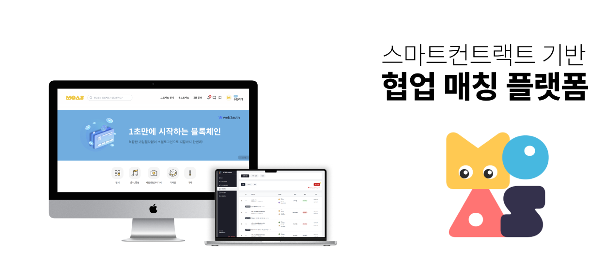
<br><br><br>


## ✨ 주요 기능

### 프로젝트 관리
리더는 프로젝트를 등록하고, 아티스트는 관심 분야와 지역별로 프로젝트를 검색하여 지원할 수 있습니다.

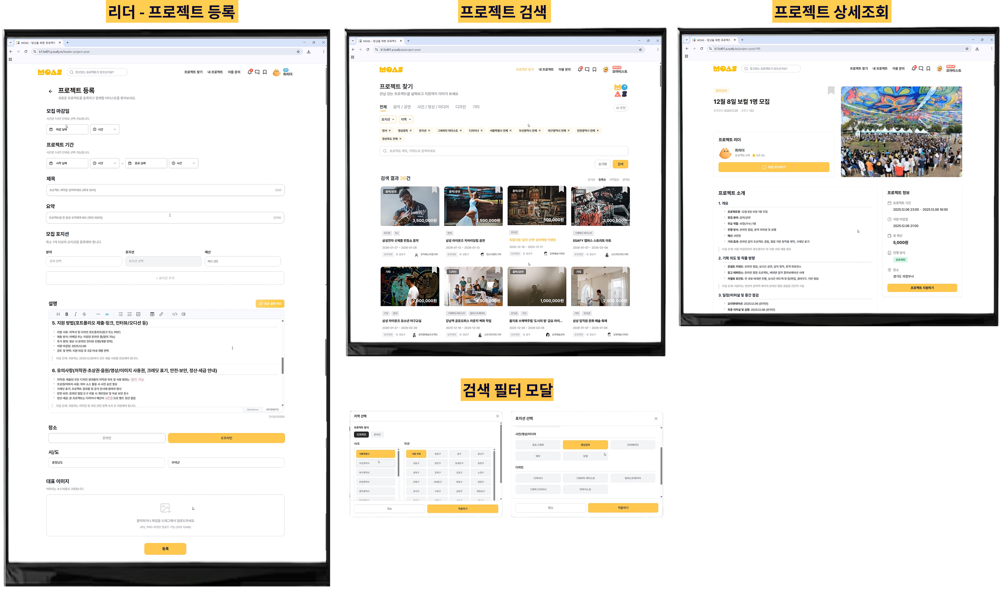
<br><br><br>


### AI 기반 프로젝트 추천
벡터 DB(Qdrant)를 활용하여 아티스트의 지원 이력과 현재 보고 있는 프로젝트를 분석해 유사한 프로젝트를 추천합니다. 아티스트의 관심사와 경력에 맞는 최적의 프로젝트를 찾을 수 있습니다.

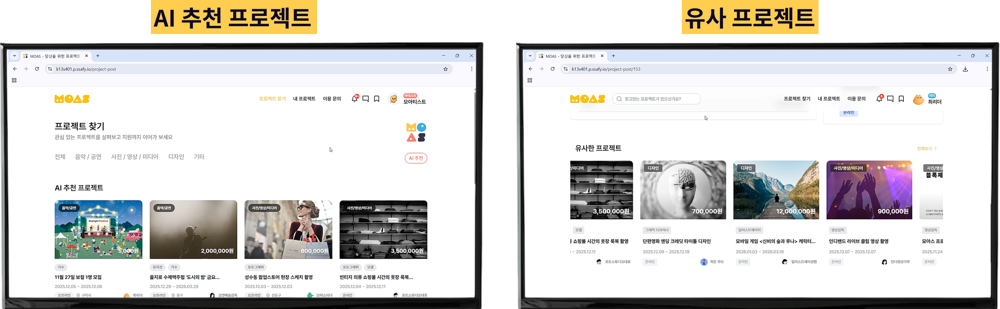
<br><br><br>


### 지원자 관리
프로젝트 리더는 지원자의 포트폴리오와 지원서를 검토하여 합격/불합격을 처리할 수 있습니다.

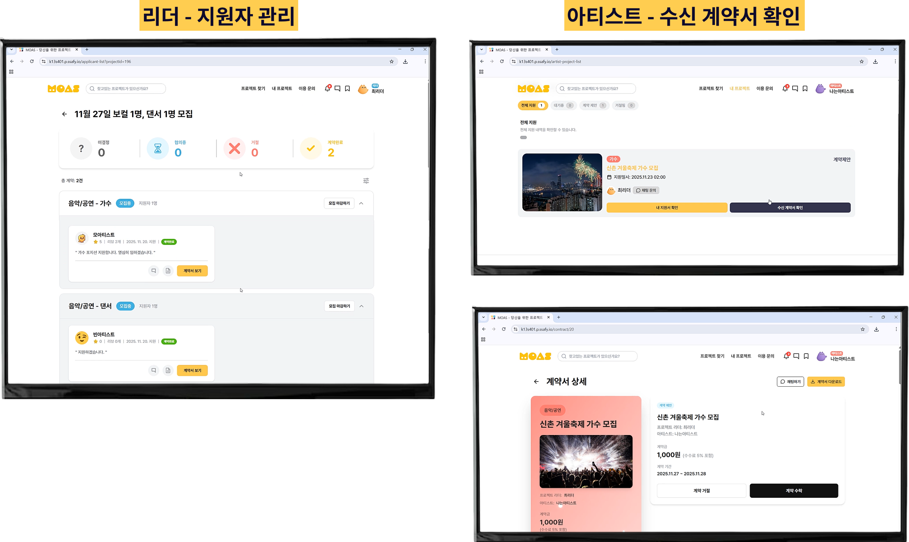
<br><br><br>


### 계약서 작성
AI가 프로젝트 내용을 분석하여 자동으로 계약서 초안을 생성합니다. 아티스트는 초안을 토대로 직접 필요한 내용을 보충할 수 있으며, 계약서 데이터는 서버에 안전하게 보관됩니다.

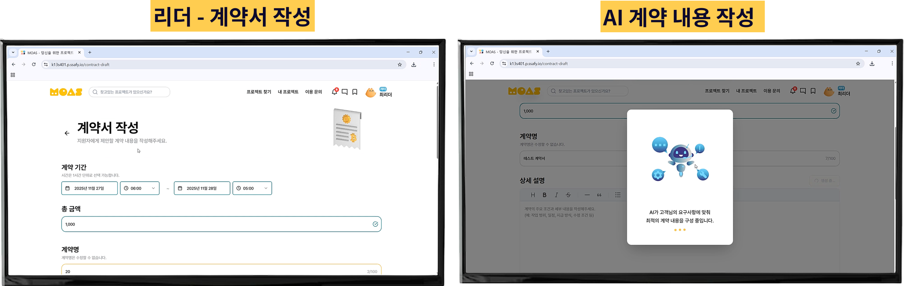
<br><br><br>


### 스마트 계약 시스템(계약서 서명)
아티스트와 리더가 모두 계약서의 내용에 동의할 경우 계약서 서명을 진행합니다. 아티스트의 서명을 받은 후, 리더는 아티스트에게 지급할 금액을 결제해야 최종 서명이 완료됩니다.

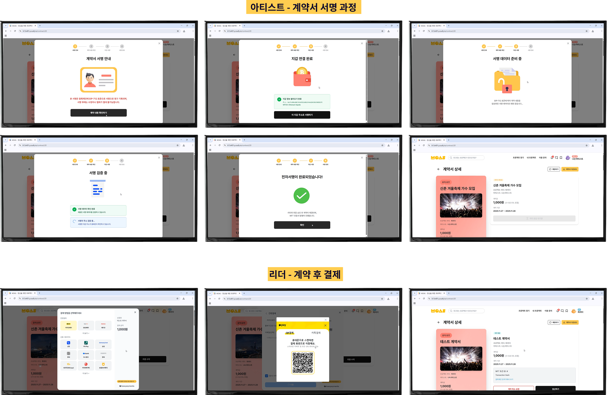
<br><br><br>


### 생성된 NFT 조회
계약이 정식으로 체결되면 블록체인에 NFT로 발행되어 계약의 불변성과 소유권을 보장합니다. 생성된 NFT는 상태에 따라 이미지가 동적으로 변하며 블록체인 탐색기에서 확인할 수 있습니다.

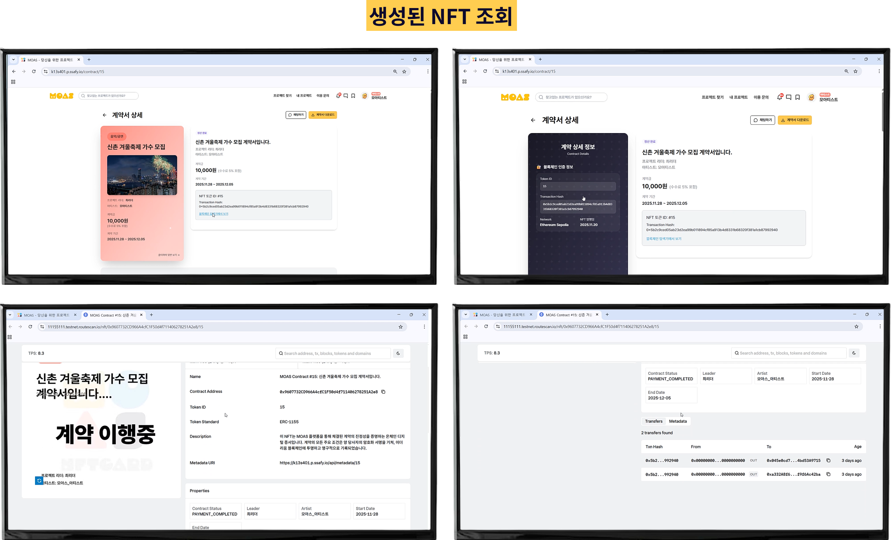
<br><br><br>


### 내 프로젝트/계약 관리
리더의 경우 내가 만든 프로젝트/계약, 리더의 경우 지원한 프로젝트/계약을 관리할 수 있습니다.

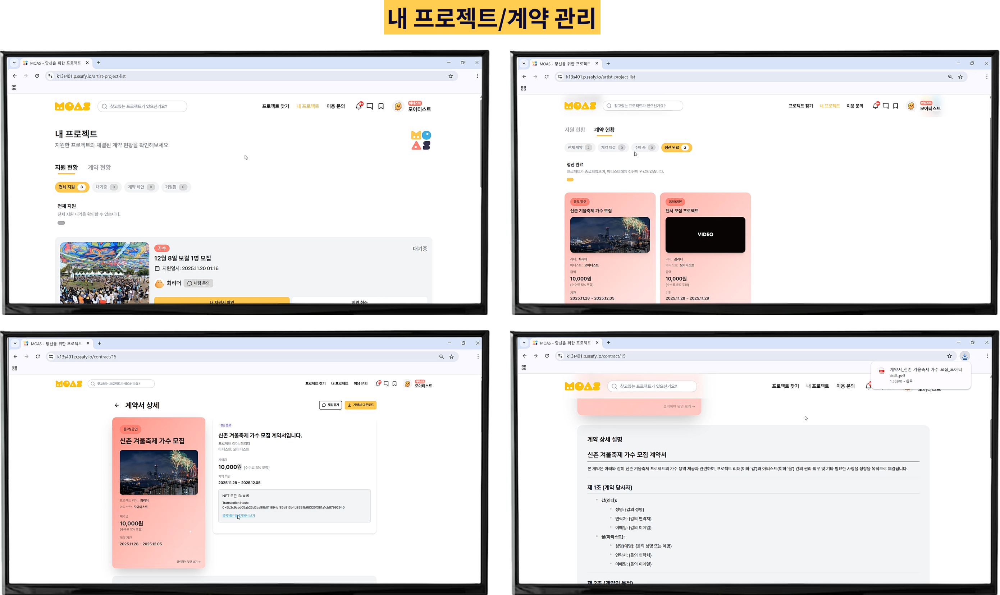
<br><br><br>


### 포트폴리오 관리
아티스트는 자신의 작품과 경력을 포트폴리오로 관리하고, 프로젝트 지원 시 활용할 수 있습니다.

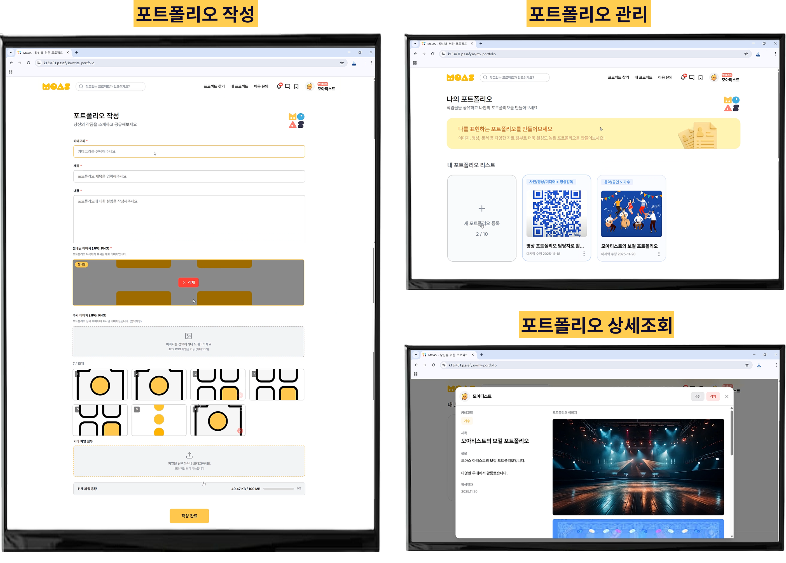
<br><br><br>


### 실시간 채팅 & 알림
SSE(Server-Sent Events) 기반으로 실시간 채팅과 알림을 제공합니다. 프로젝트 업데이트, 지원 결과, 계약 상태 변경 등 중요한 이벤트를 실시간으로 받아볼 수 있습니다.

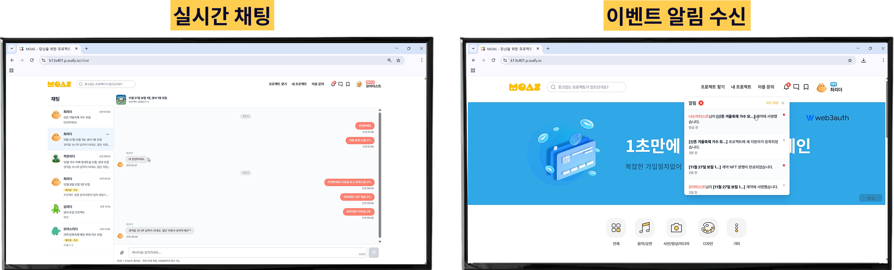
<br><br><br>


### 리뷰 시스템
프로젝트 완료 후 참여자들은 서로에게 리뷰를 남기고 평점을 매길 수 있습니다.

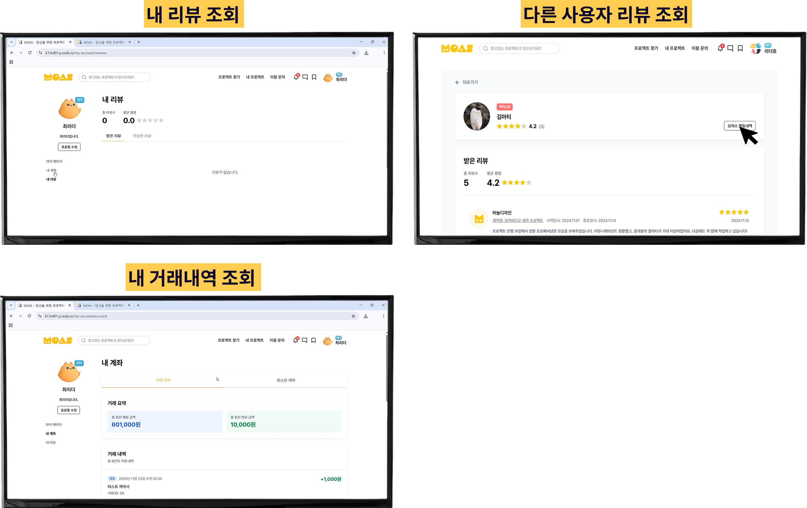
<br><br><br>


### 관리자 대시보드
사용자 관리, 계약 모니터링, 결제 현황, 수수료 정책 설정, 프로젝트 제재 등 플랫폼 전반을 관리할 수 있습니다.

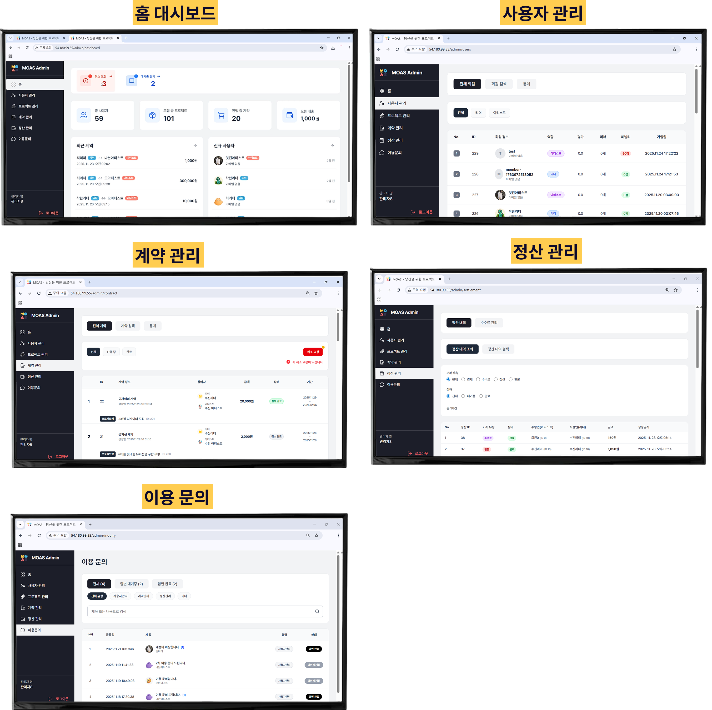
<br><br><br>


## 🛠️ 기술 스택

| 구분 | 기술 |
|------|------|
| **Frontend** | React, TypeScript, Vite, Zustand, TanStack Query, Axios, Tailwind CSS |
| **Backend** | Java, Spring Boot, Spring Data JPA, Spring Security, Gradle, MySQL |
| **Web3** | Web3Auth, Wagmi, Viem, Web3j |
| **Blockchain** | Hardhat, Solidity, OpenZeppelin |
| **AI** | Spring AI, Qdrant (Vector DB) |
| **실시간 통신** | Server-Sent Events (SSE) |
| **결제** | Toss Payments API |
| **Database** | MySQL, Redis |
| **Storage** | AWS S3 |
| **Infra** | Docker, Docker Compose, Jenkins, Nginx |

## 📂 프로젝트 구조

```
S13P31S401/
├── backend/           # Spring Boot 백엔드 API 서버
│   └── moas/
├── frontend/          # React TypeScript 프론트엔드 애플리케이션
│   ├── moas/
│   └── examples/      # Web3Auth 및 SSE 예제
├── blockchain/        # Hardhat 블록체인 프로젝트
│   └── moas-blockchain/
│       └── contracts/ # Solidity 스마트 계약
├── exec/              # SQL 덤프 및 프로젝트 문서
│   ├── S401_시연_시나리오.pdf
│   ├── S401_외부서비스목록.pdf
│   ├── S401_포팅매뉴얼.pdf
│   └── moas_db_dump_20251119.sql
├── readme/            # README 이미지 폴더
├── docker-compose.yml # 서비스 실행을 위한 Docker Compose 설정
├── Jenkinsfile        # CI/CD 파이프라인
└── README.md          # 프로젝트 소개
```

## 🚀 시작하기

자세한 사항은 **exec/S401_포팅매뉴얼.pdf** 참고

### 설치 및 실행

#### 1. 저장소 복제

```bash
git clone https://lab.ssafy.com/s13-final/S13P31S401.git
cd S13P31S401
```

#### 2. 환경 변수 설정

- 프로젝트 루트 디렉토리에 `.env` 파일을 생성하고 필요한 환경 변수를 설정합니다.
- `frontend/moas/` 디렉토리에도 `.env` 파일을 생성하여 프론트엔드 관련 환경 변수를 설정합니다.
- `blockchain/moas-blockchain/` 디렉토리에 `.env` 파일을 생성하여 블록체인 배포 관련 설정을 추가합니다.

#### 3. 데이터베이스

- 로컬 또는 원격 데이터베이스에 MySQL 스키마를 생성합니다.
- `exec/moas_db_dump_20251119.sql` 파일을 사용하여 데이터베이스 테이블과 초기 데이터를 임포트합니다.

#### 4. Docker Compose를 이용한 전체 서비스 실행

```bash
docker-compose up --build -d
```

#### 5. 서비스 접속

- **Frontend**: http://localhost:5173
- **Backend API**: http://localhost:8080/swagger-ui/index.html
- **Blockchain Node**: 로컬 Hardhat 노드 또는 배포된 네트워크

## 📋 주요 모듈 설명

### Backend 모듈

| 모듈 | 설명 |
|------|------|
| `admin` | 관리자 대시보드 및 관리 기능 |
| `application` | 프로젝트 지원 관리 |
| `auth` | Web3Auth 기반 인증/인가 |
| `bank` | 은행 연동 |
| `blockchain` | 블록체인 통합 및 스마트 계약 관리 |
| `chat` | SSE 기반 실시간 채팅 |
| `contract` | 계약서 생성, 서명, 관리 및 NFT 발행 |
| `member` | 사용자 관리 |
| `notification` | SSE 기반 알림 |
| `payment` | Toss Payments 결제 처리 |
| `portfolio` | 포트폴리오 관리 |
| `project` | 프로젝트 CRUD 및 검색, AI 기반 추천 |
| `region` | 지역 정보 관리 |
| `review` | 리뷰 및 평점 시스템 |

### Blockchain 스마트 계약

- **MOASContract.sol**: 프로젝트 계약 NFT 발행 및 관리
- **MoAsForwarder.sol**: 가스비 대납을 위한 메타 트랜잭션 중계

## 🔑 핵심 기술 특징

### 1. Web3 통합
- Web3Auth를 통한 소셜 로그인 및 암호화폐 지갑 연동
- Wagmi와 Viem을 활용한 블록체인 트랜잭션 처리

### 2. AI 기반 계약서 생성
- Spring AI를 활용하여 프로젝트 정보를 분석하고 계약서 초안을 자동 생성

### 3. 벡터 검색 및 추천
- Qdrant Vector DB를 활용한 포트폴리오 및 프로젝트 의미 기반 검색
- 아티스트의 지원 이력 분석을 통한 맞춤형 프로젝트 추천
- 현재 보고 있는 프로젝트와 유사한 프로젝트 자동 추천

### 4. 계약 NFT 시스템
- 계약 체결 데이터는 서버 데이터베이스에 안전하게 저장
- 계약 성사 시 블록체인에 NFT로 발행하여 계약의 불변성 보장
- 스마트 계약을 통한 계약 소유권 및 이력 관리

### 5. 실시간 통신
- SSE(Server-Sent Events)를 통한 실시간 채팅 및 알림 스트리밍

### 6. 안전한 결제
- Toss Payments API를 통한 결제 처리 및 정산 자동화

## 📚 추가 문서

- **시연 시나리오**: `exec/S401_시연_시나리오.pdf`
- **외부 서비스 목록**: `exec/S401_외부서비스목록.pdf`
- **포팅 매뉴얼**: `exec/S401_포팅매뉴얼.pdf`
